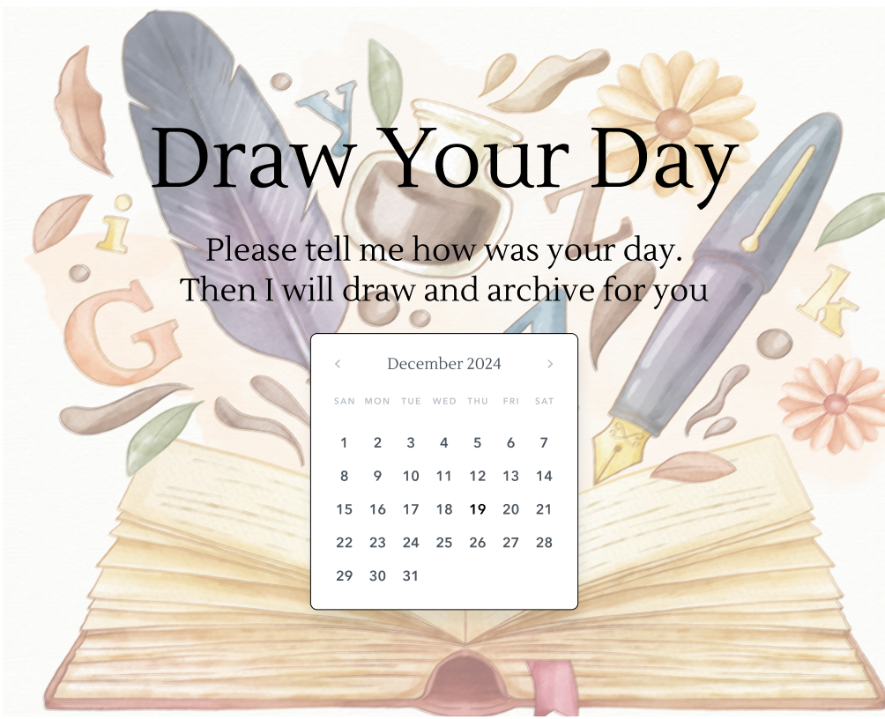
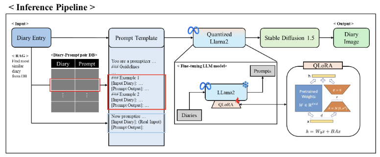
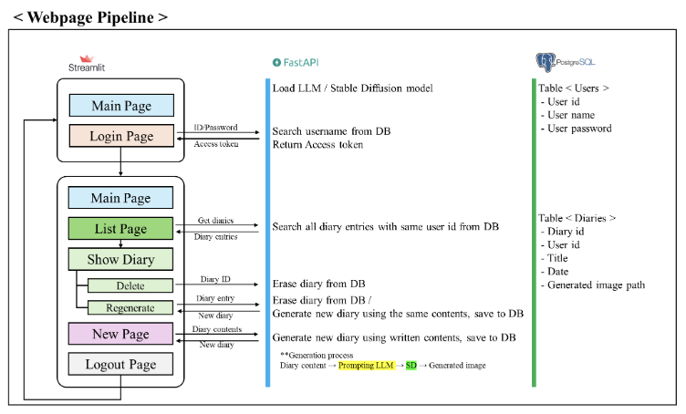

# Draw Your Day: Efficient AI-enhanced Diary-to-Illustration Experience #

    2024.09.11 ~ 2024.12.09

    Paper | 
    <a href="https://drive.google.com/file/d/1IdP6FAxAVGZwrP7VkzODqhutnwOywowr/view?usp=sharing">Poster</a>

 

    

**Draw You Day** is an AI-enhanced service that transforms your diaries to vivid illustrations.

Draw Your Day is powered by **FastAPI**, **StreamLit** and **PostgreSQL**. Our service leverages **QLoRA-finetuned LLaMa-2** and **Stable Diffusion 1.5**. Our service only consumes 8GB VRAM in total for inference without any use of APIs.

## Front/Backend Pipeline

    

## AI Pipeline

    

